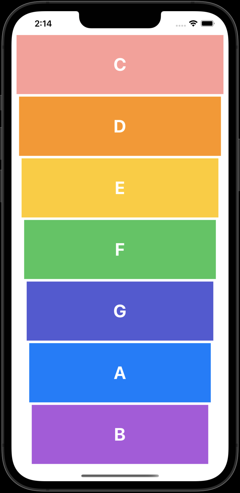
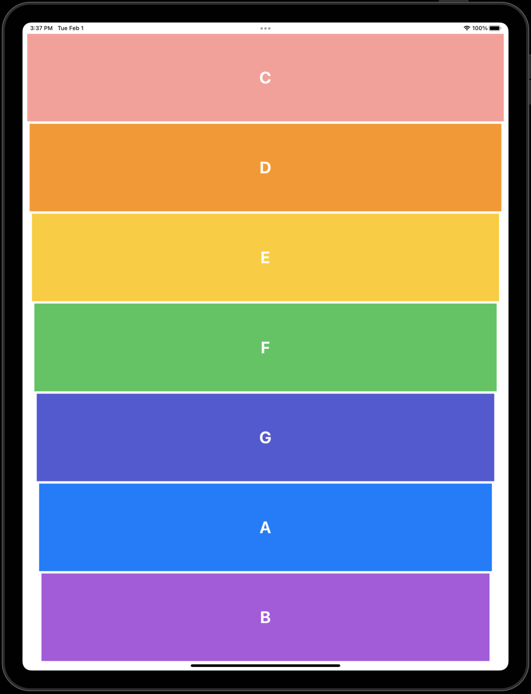

# Xylophone In Swift

A Xylophone app in which we learned how to play sound and use an Apple library called AVFoundation.


## What we learn
- How to play sound using AVFoundation and AVAudioPlayer.
- How link multiple buttons to the same @IBAction.
- How to get button title.
- Use of ```guard``` statement.
- How to change opacity.
- How to execute a block after some time. 
- Functions with Argument Labels and Parameter Names in Swift.
- How to get the file Path/URL for the resource by the file name and its extension.

## Build On
- XCode 13.2
- Swift 5.5


## Screenshots

### iPhone


### iPad



## Contact
**Name:** Manish Ahire

**Portfolio:** [www.manishahire.com](https://www.manishahire.com/) 

**Blog:** [www.mobodevstuff.com](https://www.mobodevstuff.com/) 
